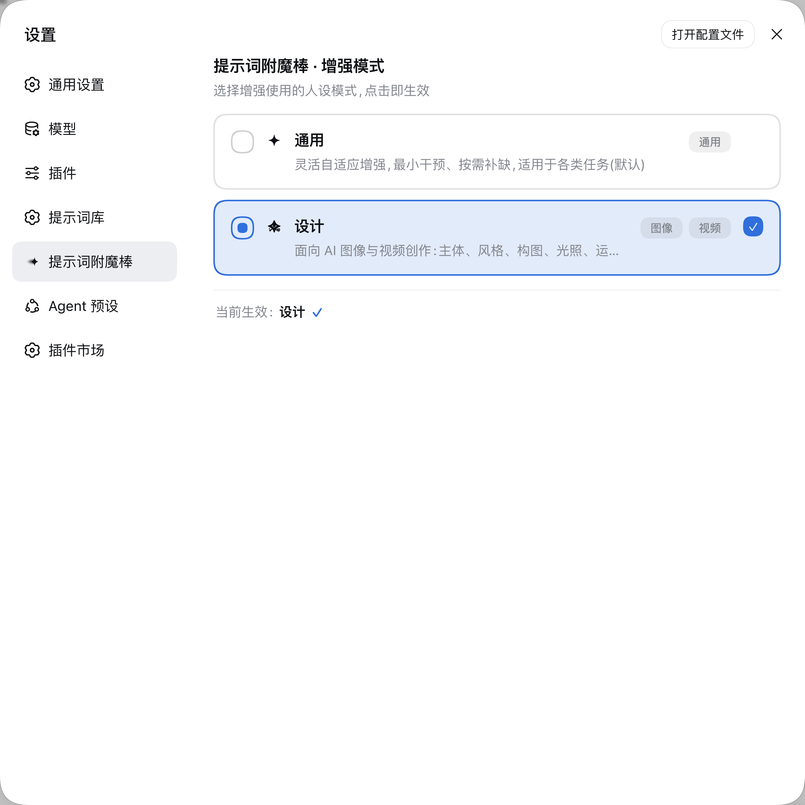
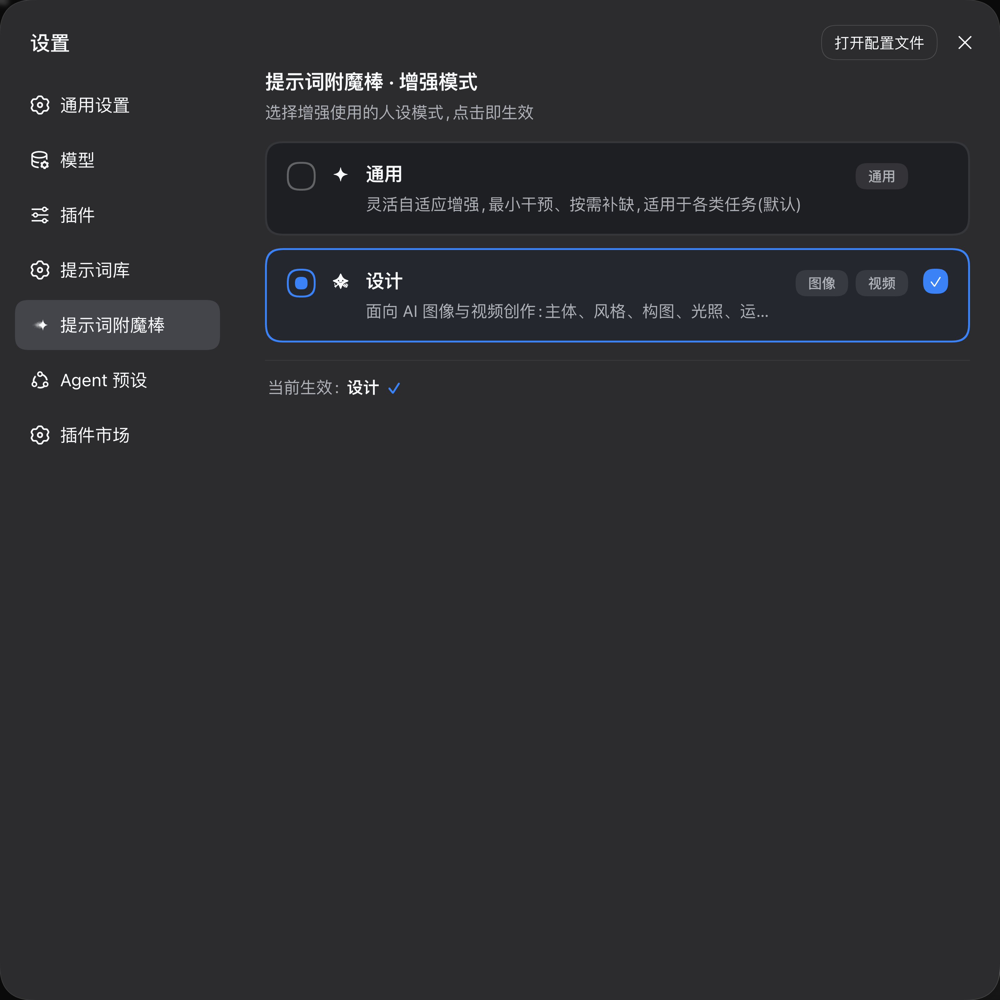
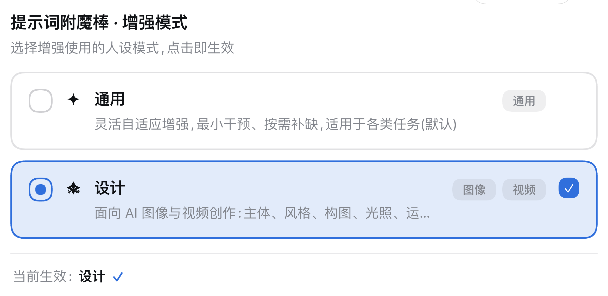
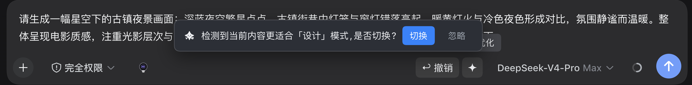
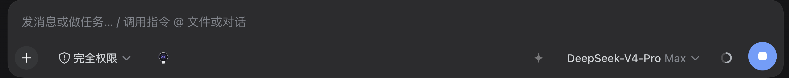
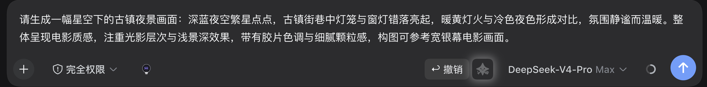
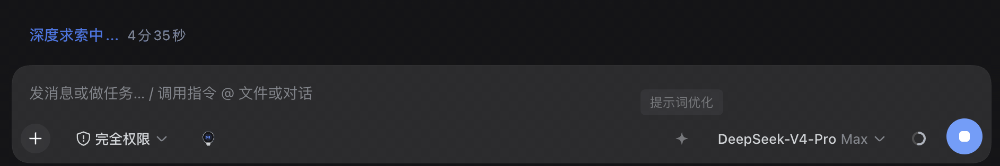

# dsh-prompt-enchant · Prompt-Enchanting Magic Wand

**🌐 Language | 语言:[中文](./README.md) · English**

Adds a **four-point sparkle magic-wand button** to the input box of the [DeepSeek Harness (DSH)](https://github.com/deepseek-ai) Web chat UI. On click, it enhances the user's colloquial, fragmented, possibly typo-ridden input into a more precise expression that AI can understand and execute, through a **standalone LLM call**, then fills the result back into the input box for human review before sending.

> This project is an original implementation of a generic "prompt enhancement" capability. It is not associated with any third-party product trademarks or icons.

## 🚀 Quick Install (disk-resident, auto-loads after restart)

1. Clone the repository:
   ```bash
   git clone https://github.com/Kian-Oraish/dsh-prompt-enchant.git
   cd dsh-prompt-enchant
   ```
2. Run the installer (idempotent — safe to re-run; copies the plugin into the DSH plugin directory and registers the composition config):
   ```bash
   ./install.sh
   ```
   What it does:
   - copies the plugin to `$HOME/.dsh/profiles/web/node_modules/dsh-prompt-enhance/`;
   - registers the row `- insert: - id: prompt-enhance` in `$HOME/.dsh/profiles/web/cordis.patch.yml`.
3. **Restart DSH** (the dsh process serving the Web UI) — no per-session pasting required;
4. The magic wand appears at the bottom-right of the input box: type a colloquial request → click the star → the enhanced text fills back → edit and send.

**Update / uninstall**:
- Update: edit the repo code, re-run `./install.sh`, restart;
- Uninstall: remove `$HOME/.dsh/profiles/web/node_modules/dsh-prompt-enhance/` and the `id: prompt-enhance` insert block from `cordis.patch.yml`, then restart.

> Alternative "dynamic plugin" form (no restart, in-process, temporary): paste `dynamic/host.js` and `dynamic/client.js` into the DSH Web GUI plugin panel and run; it disappears after a process restart. Feature-wise both forms are identical; the disk-resident form is recommended.

## ✨ Features

1. **First-class settings entry**: a top-level "Prompt Enchant" section in the DSH settings backend's left navigation (particle-generation-star icon), same form factor as the prompt library.
2. **Dual persona modes**: "General / Design" enhancement personas backed by the official `ctx.settings`, persisted to `settings.yaml`, applied instantly on click and kept across restarts; degrades to "General" when the settings service is absent (older frameworks).
3. **Design-mode professional layer**: for AI image creation (text-to-image / image-to-image / interactive edit) and video creation (text-to-video / image-to-video / first-last frames) — terminology and completion of professional elements such as subject, style, composition, lighting, camera movement and first/last frames, with 【待确认】 marks on unconfirmed elements; non-creative input automatically falls back to general enhancement.
4. **Mode suggestion mechanism**: when enhancing image/video-creation content in General mode, a suggestion bar appears above the input — "this content fits the Design mode better, switch?"; one click persists the mode and automatically re-runs enhancement on the original input with the new mode.
5. **Mode icon system**: Design mode = mascot star, settings entry = particle-generation star, General = four-point sparkle; all inline `currentColor` SVGs — one file serves both light and dark themes, strictly solid fill.
6. **Modern visual panel**: mode cards with custom radio dot, scene tags (Image/Video/General), single-line truncated description with full tooltip, high-contrast selected state with accent border and checkmark, and a bottom "Currently active" status bar; keyboard accessible and reduced-motion friendly.
7. **Security & reference protection** (foundation): shared hard-rule core — @ reference tokens preserved verbatim, plain-text output, injection defense; on the new framework, drafts containing @ references disable enhancement to protect reference injection; `/plan`-style command claims stay untouched; hardened API layer (POST-only / JSON / cross-site rejection / concurrency cap).

## Walkthrough Demos

| Settings panel · light (Design selected) | Settings panel · dark (Design selected) |
| --- | --- |
|  |  |

| Card detail (scene tags / status bar) | Suggestion bar (above the input) |
| --- | --- |
|  |  |

| Wand · General mode (sparkle) | Wand · Design mode (mascot star) | After one-click switch · Design-mode output |
| --- | --- | --- |
|  |  |  |

**Mode suggestion full flow** (enhance → suggestion bar → one-click switch → automatic re-run):



Details of reference preservation and command-claim safety live in the "Compatibility & Security" section.

## How It Works

A two-stage pipeline (deterministic code + one adaptive LLM call):

```
User input (optionally with conversation context)
        │
        ▼
[① Deterministic] Input parsing: language detection · code fences · format tokens · length gate
        │
        ▼
[②③④ Single LLM call] Adaptive enhancement: four levels + multi-turn mode + five hard rules
        │
        ▼
[⑤ Deterministic] Final validation: language / length / code blocks → one retry on failure → fallbacks (strip code / fence-safe truncation)
        │
        ▼
Fill back into the input box (editable) → user confirms → send
```

Architecture: the Host half (an ESM Cordis plugin) is mounted in the DSH composition and serves `/prompt-enhance/api/enhance` plus icon routes; the Client half is a pre-built web bundle auto-served and loaded by DSH clientModules, talking to the Host over HTTP. The enhancement is a **standalone call** — it does not inject into or modify the agent's own system prompt.

## Directory Structure

```
dsh-prompt-enchant/
├── README.md / README.en.md    # bilingual docs
├── LICENSE
├── package.json                # plugin package metadata (dsh.bundle + dsh.client declarations)
├── cordis.patch.yml            # composition patch: registers the id: prompt-enhance row
├── install.sh                  # one-shot installer (copy to plugin dir + config reference + restart hint)
├── lib/
│   ├── index.js                # Host half: pipeline, HTTP routes, self-test tools
│   └── client.js               # Client half (pre-built bundle): wand button & interactions
├── config/
│   └── enhance-prompt.md       # tunable: the full enhancement system prompt
├── dynamic/                    # alternative: dynamic-plugin form (paste & run, no restart)
│   ├── host.js
│   └── client.js
└── assets/icons/               # mode icons (bundled; UI uses inline SVG currentColor)
    ├── sparkle.svg             # General mode · four-point sparkle
    ├── design.svg              # Design mode · mascot star (evenodd)
    ├── genstar.svg             # settings entry · particle-generation star (evenodd)
    ├── sparkle_black.svg       # fixed black (compatibility)
    ├── sparkle_white.svg       # fixed white (compatibility)
    ├── sparkle_black_128.png   # bitmap fallback (light theme)
    └── sparkle_white_128.png   # bitmap fallback (dark theme)
```

## Configuration

The disk-resident form reads optional row `config` (all values have defaults):

| Option | Default | Description |
| --- | --- | --- |
| `diagFile` | empty (off) | Absolute path of the diagnostic log (append-only) |
| `maxInputChars` / `maxOutputChars` | 20000 / 6000 | Input / output length limits |
| `historySanitize` | `true` | Toggle for stripping Markdown markers from multi-turn history |
| `temperature` | `0.3` | Sampling temperature for enhancement calls |
| Enhancement prompt | `config/enhance-prompt.md` | The semantic asset; tune by replacing `FLEXIBLE_SYSTEM_PROMPT` in `lib/index.js` |

## Icon Assets

`assets/icons` holds the mode icon set (a coordinated family): General mode = `sparkle.svg` (four-point sparkle); Design mode = `design.svg` (mascot star, `fill-rule="evenodd"` negative-space details); settings entry = `genstar.svg` (particle-generation star, `evenodd`). **Always prefer the currentColor inline SVGs**: the color follows the button text color and one file serves both themes (switching with the DSH theme flag `body[data-ds-dark-theme]`); fixed-color SVGs and transparent-background PNGs (128×128) are compatibility fallbacks; JPEG must never be wired into the UI. The icons were generated by the repository owner with Doubao Seedream and processed locally; they are released with this repository under the MIT license.

## Privacy & Security

- No API keys, no telemetry; enhancement calls go through DSH's `llm` service and the current default model;
- User input only flows inside the local DSH process and is never sent to any third party;
- The plugin only registers local loopback HTTP routes and listens on no external interface.

## Compatibility & Security

**Framework contracts** (verified live on DSH **0.1.1-rc.2**, including every demo asset; also re-checked item by item against the on-disk **0.1.2-alpha.2 / alpha.5** type contracts): `conversation.input.right` slot registration (`id/order/label`, kind=list/scope=session) with the InputZone standard props; `defineTool` property-map parameters; the `dsh.client` declaration with the clientModules pre-built bundle format; the `body[data-ds-dark-theme]` theme flag; v0.3.0 additionally uses the official `ctx.settings` seam (namespace `prompt-enhance`) and the settings-backend top-level section slot `settings.section` (order 19, same pattern as the prompt library), both verified line-by-line against the alpha.5 sources.

**Version compatibility matrix**:

| DSH version | Enhance | Multi-turn context | @ reference handling | Settings backend (mode switch) |
| --- | --- | --- | --- | --- |
| 0.1.1-rc.2 (live-verified) | ✅ | ✅ (`useSession` snapshot) | ✅ references preserved verbatim after enhancement; chip state and send-time file serialization fully intact | ❌ no settings entry; always uses the "General" mode |
| 0.1.2-alpha.x (alpha.5 contract-checked) | ✅ | ⚠️ degrades to single-turn (`useSession` removed; `useConversation` carries no message history) | ⚠️ the input machine is now a Lexical editor with no public reference re-insertion verb — `setDraft` would turn reference chips into plain-text mentions (no file-content injection on send). So **drafts containing @ references disable the button on this version** (hover explains why), protecting reference integrity; drafts without references enhance normally | ✅ the Settings backend gains a top-level left-nav section "Prompt Enchant": single-select mode list, applies instantly (currently only "General"; vertical modes arrive with the registry) |
| Older builds (no client slot system) | ⚠️ button does not render | — | — | — |

`dsh.client.inject` only declares packages that actually exist in the client module graph (`locale` / `ui-conversation`; `dsh-client-runtime` and `dsh-client-ui-slots` no longer exist on the new version and this package never referenced them, so they are not injected); the client bundle only `require('react')` and obtains the slot service via `ctx.get('slots')`. The settings card mounts lazily through `ctx.get('settingsScope')` (not added to the inject list), so on older frameworks or during load-order races it silently skips without affecting the wand button.

**Mode (persona) architecture** (v0.3.0): the prompt = shared hard-rule core (`CORE_A`/`CORE_B` in `lib/modes.js`, covering @-reference protection, injection defense, and the plain-text protocol — no mode may override them) + a mode-specific layer; the host-side registry lives in `lib/modes.js`, settings persist to `~/.dsh/settings.yaml` via the official `ctx.settings`, and the host assembles the prompt from the current mode in real time; the client reads mode metadata through `GET /prompt-enhance/api/modes` to render the card. Enhance responses always carry a `suggestedMode` field (`null` while a single mode exists), reserving the hook for the future "this content fits mode X — switch?" suggestion.

**Command-plugin interaction** (`/plan`, `/goal`, ...): while a command is claimed, the user **can** click enhance — the plugin only rewrites the text AFTER the command token, leaving the token and the claim untouched, so the result never affects the command's invocation or display; the button is disabled when the command token cannot be located or while adjudicating/submitting. This plugin's namespaces (`prompt-enhance`, `prompt_enhance_*`, `pwe-*`, `/prompt-enhance/*`) do not overlap with those commands.

**@ reference protection** (`@filename`, `@file-path`, `@session-name`, ...): reference tokens are treated as untouchable placeholders during enhancement — a hard prompt rule requires them to be preserved verbatim and in order, the output is verified deterministically, a failed check triggers one retry and then falls back to the original text; the client fills the result back gap-by-gap (only the prose between references is rewritten), so the references' occurrence state and send-time file serialization are fully preserved; undo restores only the gap texts as well.

**Security boundaries**:
- The API rides DSH's webServer, loopback-bound (`127.0.0.1`) by default; if a deployment binds `0.0.0.0`, the exposure risk is yours;
- Request-level guards: `application/json` only; cross-origin/cross-site requests rejected (`Origin` / `Sec-Fetch-Site` checks); in-flight cap of 2 (429 above); 4MB body limit;
- Response hardening: `Cache-Control: no-store` + `X-Content-Type-Options: nosniff`;
- Output sanitization: strips Markdown decoration, emoji, bidi control and zero-width characters (display-layer injection defense);
- No authentication by design — do not expose this port on a shared host; route/tool registration is fault-tolerant and degrades instead of crashing when the framework evolves.

## License

[MIT](./LICENSE) © 2026 Kian-Oraish
